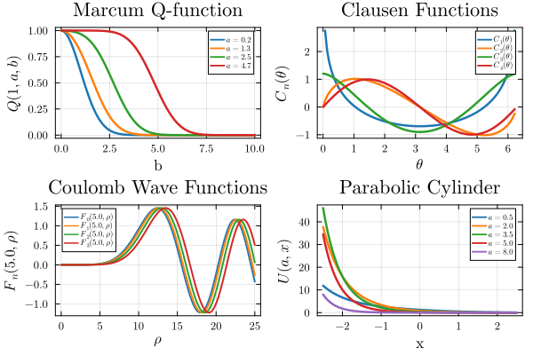

# FewSpecialFunctions

[](https://martinmikkelsen.github.io/FewSpecialFunctions.jl/dev/)


Very quick implementation of a few different (special) functions. This includes 

1. Clausen function 
2. Coulomb wave functions
3. Debye function
4. Fresnel functions
5. Struve functions
6. Hypergeometric functions
7. Confluent Hypergeometric functions

TODO

2. Other functions
3. Better tests



```yaml
cff-version: 1.2.0
title: FewSpecialFunctions.jl
message: >-
  You can cite if you want.
type: software
authors:
  - given-names: Martin
    family-names: Mikkelsen
    email: MartinMikkelsen@proton.me
repository-code: 'https://github.com/MartinMikkelsen/FewSpecialFunctions.jl'
license: MIT
version: 0.1.4
date-released: '2023-01-26'
```