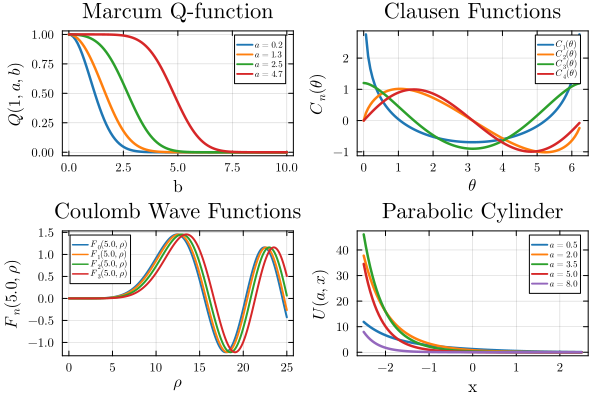

# FewSpecialFunctions.jl

[](https://martinmikkelsen.github.io/FewSpecialFunctions.jl/dev/)
[](https://github.com/MartinMikkelsen/FewSpecialFunctions.jl/actions/workflows/ci.yml)
[](https://codecov.io/gh/MartinMikkelsen/FewSpecialFunctions.jl)
[](https://github.com/JuliaTesting/Aqua.jl)

A Julia package collecting a few special functions. Now includes over 13000 tests. Includes the following functions:

- [Clausen functions](https://en.wikipedia.org/wiki/Clausen_function)
- [Marcum-Q functions](https://en.wikipedia.org/wiki/Marcum_Q-function)
- [Parabolic cylinder functions](https://en.wikipedia.org/wiki/Parabolic_cylinder_function)
- [Coulomb wave functions](https://en.wikipedia.org/wiki/Coulomb_wave_function)
- [Whittaker functions](https://dlmf.nist.gov/13.14)
- [Debye functions](https://en.wikipedia.org/wiki/Debye_function)
- [Fermi-Dirac integrals](https://en.wikipedia.org/wiki/Incomplete_Fermi%E2%80%93Dirac_integral)
- [Bose–Einstein integrals](https://martinmikkelsen.github.io/FewSpecialFunctions.jl/dev/Functions/#Bose–Einstein-integrals)
- [Fresnel integrals](https://en.wikipedia.org/wiki/Fresnel_integral)
- [Voigt profile](https://en.wikipedia.org/wiki/Voigt_profile)

### Install 

Get the latest stable release with Julia's package manager:

```
julia ] add FewSpecialFunctions
```
Or use 
```
julia ] add https://github.com/MartinMikkelsen/FewSpecialFunctions.jl
```

### Examples
```julia
julia> using FewSpecialFunctions

julia> FermiDiracIntegral(3 / 2, 1.0)
2.6616826247307124

julia> BoseEinsteinIntegralNorm(1 / 2, -1.0) ≈ 0.4284407345998379
true
```

`BoseEinsteinIntegral(k, η)` evaluates the unnormalized integral for integer or
half-integer `k > -1` and real `η ≤ 0`. `BoseEinsteinIntegralNorm(k, η)` divides
by `Γ(k + 1)` and extends to integer or half-integer orders `k ≥ -9/2` by
differentiation. Both support `Float32`, `Float64`, `BigFloat`, broadcasting,
and ForwardDiff differentiation with respect to `η`.

Whittaker functions and their argument derivatives are available as
`WhittakerM(κ, μ, z)`, `WhittakerW(κ, μ, z)`, `dWhittakerM`, and
`dWhittakerW`. They support real and complex floating-point inputs, including
`BigFloat`, on the principal branch for nonzero `z`.

```julia
julia> WhittakerW(0, 0.5, 2) ≈ exp(-1)
true

julia> ParabolicCylinderD(1, 2) ≈ 2exp(-1)
true

julia> isfinite(U_scaled(0, 60)) && isfinite(V_scaled(0, 60))
true
```

`ParabolicCylinderD(ν, x)` and `dParabolicCylinderD(ν, x)` use the existing
real cylinder kernel. For `x ≥ 0`, `U_scaled`, `V_scaled`, and
`ParabolicCylinderD_scaled` remove the dominant growth or decay in both
order and argument using the convention of Gil, Segura & Temme (2006).
These scaled values can remain representable when the ordinary functions
underflow or overflow. See the documentation for the precise scaling factor.

### Some other examples

Some other examples are shown in the [documentation](https://martinmikkelsen.github.io/FewSpecialFunctions.jl/dev/).


