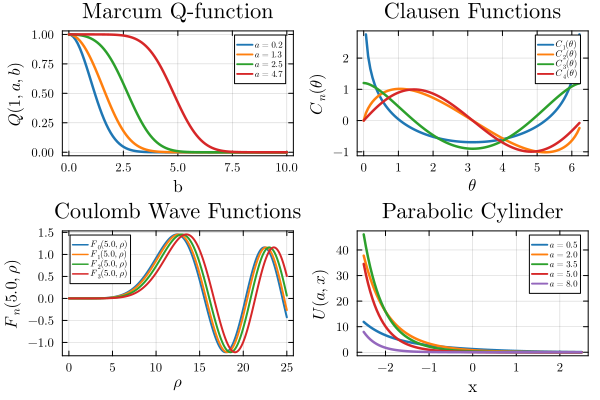

# FewSpecialFunctions.jl

[](https://martinmikkelsen.github.io/FewSpecialFunctions.jl/dev/)
[](https://github.com/MartinMikkelsen/FewSpecialFunctions.jl/actions/workflows/ci.yml)
[](https://codecov.io/gh/MartinMikkelsen/FewSpecialFunctions.jl)
[](https://github.com/JuliaTesting/Aqua.jl)

FewSpecialFunctions.jl is a Julia package that provides additional special
functions and alternative numerical implementations of some functions that
exist elsewhere (for example `dawson`, which
[SpecialFunctions.jl](https://github.com/JuliaMath/SpecialFunctions.jl) also
exports). It is intended for calculations in atomic, nuclear, and solid-state
physics, spectroscopy, and signal processing, and builds on
SpecialFunctions.jl,
[HypergeometricFunctions.jl](https://github.com/JuliaMath/HypergeometricFunctions.jl),
and [QuadGK.jl](https://github.com/JuliaMath/QuadGK.jl).

The package provides:

| Family | Functions |
|:--|:--|
| [Coulomb wave functions](https://en.wikipedia.org/wiki/Coulomb_wave_function) | `F`, `G`, `H⁺`, `H⁻`, `C`, `θ`, `η`, and auxiliary functions |
| [Whittaker functions](https://dlmf.nist.gov/13.14) | `WhittakerM`, `WhittakerW`, `dWhittakerM`, `dWhittakerW` |
| [Parabolic cylinder functions](https://en.wikipedia.org/wiki/Parabolic_cylinder_function) | `U`, `V`, `W`, `dU`, `dV`, `dW`, `ParabolicCylinderD`, `dParabolicCylinderD`, `U_scaled`, `V_scaled`, `ParabolicCylinderD_scaled` |
| [Debye functions](https://en.wikipedia.org/wiki/Debye_function) | `debye_function` |
| [Fermi–Dirac integrals](https://en.wikipedia.org/wiki/Complete_Fermi%E2%80%93Dirac_integral) | `FermiDiracIntegral`, `FermiDiracIntegralNorm` |
| [Bose–Einstein integrals](https://martinmikkelsen.github.io/FewSpecialFunctions.jl/dev/Functions/#Bose–Einstein-integrals) | `BoseEinsteinIntegral`, `BoseEinsteinIntegralNorm` |
| [Marcum Q-function](https://en.wikipedia.org/wiki/Marcum_Q-function) | `MarcumQ`, `dQdb` |
| [Voigt function](https://en.wikipedia.org/wiki/Voigt_profile) | `voigt` |
| [Fresnel integrals](https://en.wikipedia.org/wiki/Fresnel_integral) | `fresnel`, `FresnelC`, `FresnelS`, `FresnelE` |
| [Dawson integral](https://en.wikipedia.org/wiki/Dawson_function) | `dawson` |
| [Clausen functions](https://en.wikipedia.org/wiki/Clausen_function) | `Clausen` |

The [documentation](https://martinmikkelsen.github.io/FewSpecialFunctions.jl/dev/)
describes each family, its domain, and its accuracy.

## Installation

The package requires Julia 1.10 or later. In a Julia session, run

```julia
import Pkg; Pkg.add("FewSpecialFunctions")
```

Equivalently, press `]` at the `julia>` prompt to enter the package mode and
type `add FewSpecialFunctions`. To install the development version instead,
use `Pkg.add(url = "https://github.com/MartinMikkelsen/FewSpecialFunctions.jl")`.

## Examples

```julia
julia> using FewSpecialFunctions

julia> FermiDiracIntegral(3 / 2, 1.0)
2.6616826247307124

julia> dawson(1.0)
0.5380795069127683

julia> BoseEinsteinIntegralNorm(1 / 2, -1.0) ≈ 0.4284407345998379
true

julia> WhittakerW(0, 0.5, 2) ≈ exp(-1)
true

julia> ParabolicCylinderD(1, 2) ≈ 2exp(-1)
true

julia> isfinite(U_scaled(0, 60)) && isfinite(V_scaled(0, 60))
true
```

In the REPL, `?dawson` (or any other function name) shows its documentation.

`BoseEinsteinIntegral(k, η)` evaluates the unnormalized integral for integer or
half-integer `k > -1` and real `η ≤ 0`. `BoseEinsteinIntegralNorm(k, η)` divides
by `Γ(k + 1)` and extends to integer or half-integer orders `k ≥ -9/2` by
differentiation.

Whittaker functions and their argument derivatives are available as
`WhittakerM(κ, μ, z)`, `WhittakerW(κ, μ, z)`, `dWhittakerM`, and
`dWhittakerW`. They support real and complex floating-point inputs on the
principal branch for nonzero `z`.

`ParabolicCylinderD(ν, x)` and `dParabolicCylinderD(ν, x)` evaluate
`Dν(x) = U(-ν - 1/2, x)` and its argument derivative. For `x ≥ 0`,
`U_scaled`, `V_scaled`, and `ParabolicCylinderD_scaled` remove the dominant
growth or decay in both order and argument using the convention of Gil,
Segura & Temme (2006). These scaled values can remain representable when the
ordinary functions underflow or overflow. See the documentation for the
precise scaling factor.

More examples, including plots, are in the
[documentation](https://martinmikkelsen.github.io/FewSpecialFunctions.jl/dev/).



## Number types and accuracy

Functions accept `Float32`, `Float64`, and `BigFloat` arguments and return a
result of the same precision. The return type is not a statement about
accuracy. Several families converge to the precision of the type, while
others are fixed approximations. For example, over `-30 ≤ x ≤ 60` the
measured relative error of `FermiDiracIntegral` is at most `2.8e-12` for the
orders `-1/2`, `1/2`, `3/2`, and `5/2`; for the other tested orders it is
`5.8e-3` to `1.2e-2` (orders `1/4`, `1`, `2`, `3`, `9/2`) and `2.9e-2` (order
`10`), also with `BigFloat` arguments. The
[accuracy page](https://martinmikkelsen.github.io/FewSpecialFunctions.jl/dev/accuracy/)
gives the test points and measured errors for each family, and
`docs/accuracy_checks.jl` reproduces them.

## Automatic differentiation

When [ForwardDiff.jl](https://github.com/JuliaDiff/ForwardDiff.jl) is loaded,
the functions accept dual numbers. Some derivatives use analytic identities
(for example the Fresnel integrals, `dawson`, the Bose–Einstein integrals in
`η`, and the argument derivatives of the Whittaker and parabolic cylinder
functions). Others are central finite differences of the function, with
reduced accuracy and no result within one step of a domain boundary. A
derivative can also have a narrower domain than the function: `MarcumQ` is
differentiable in `b` only for `M ≥ 1` and `a ≠ 0`.
Differentiation with respect to the discrete order of the Bose–Einstein
integrals throws an error. The
[differentiation page](https://martinmikkelsen.github.io/FewSpecialFunctions.jl/dev/differentiation/)
lists which arguments use which method.

## Contributing

Bug reports and pull requests are welcome. [CONTRIBUTING.md](CONTRIBUTING.md)
describes how to run the tests, build the documentation, format the code with
Runic, and report a bug.

## License and citation

The package is distributed under the [MIT license](LICENSE). If you use it
in published work, please cite it using the metadata in
[CITATION.cff](CITATION.cff); GitHub's "Cite this repository" button converts
that file to BibTeX or APA format.
